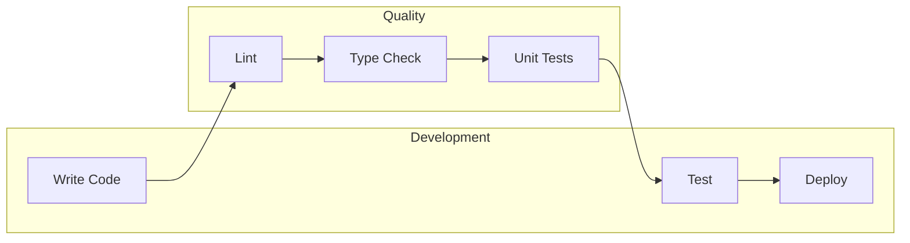

# 🏗️ Cognitive Hypermedia Framework Architecture

## 📦 High-Level Architecture

## 🔄 Data Flow

## 🧩 Component Details

### Adapters Layer

### Infrastructure Layer

## 🔄 State Management Flow

## 📚 Key Concepts

1. **Adapters Layer**
   - Protocol: Handles communication protocols
   - Logging: Manages application logging
   - Storage: Handles data persistence

2. **Infrastructure Layer**
   - Core: Contains core business logic
   - Store: Manages application state
   - Protocol: Implements protocol-specific logic

3. **Main Entry Point**
   - Serves as the framework's entry point
   - Coordinates between adapters and infrastructure
   - Handles initialization and configuration

## 🔒 Security and Data Flow

## 🛠️ Development Workflow

