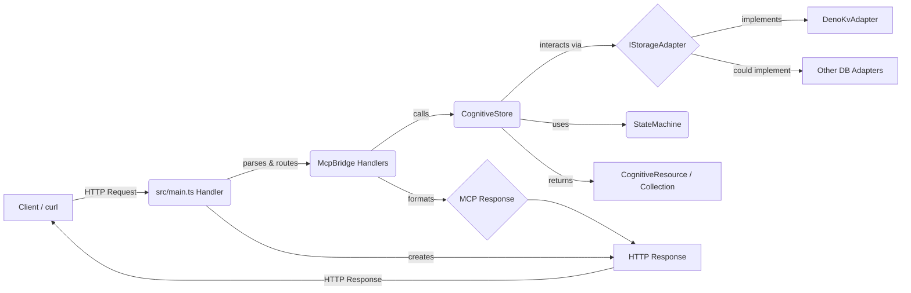
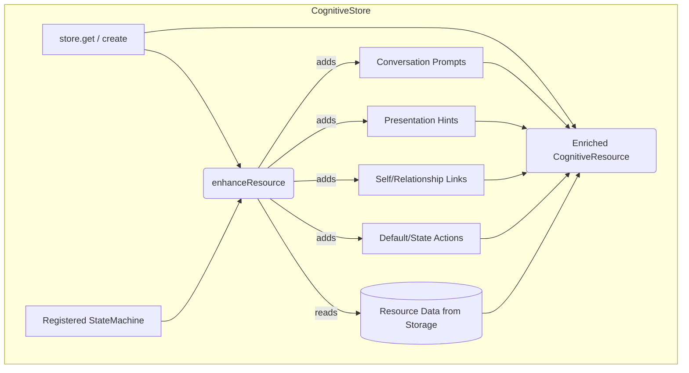
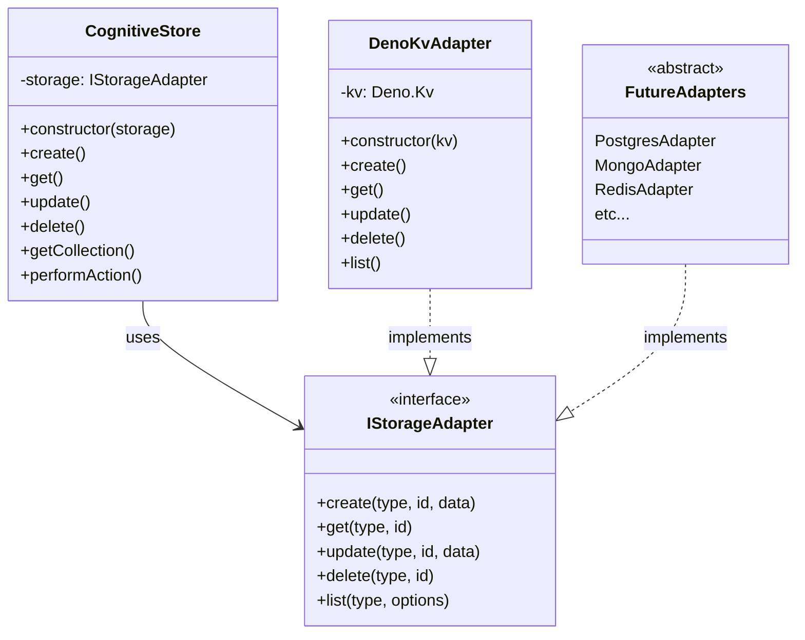

# 🏗️ Architecture Diagrams

## High-Level Request Flow

```mermaid
graph LR
    Client[Client / curl] -- HTTP Request --> Server(src/main.ts Handler);
    Server -- parses & routes --> Bridge(McpBridge Handlers);
    Bridge -- calls --> Store(CognitiveStore);
    Store -- interacts via --> Adapter{IStorageAdapter};
    Adapter -- implements --> DenoKV[DenoKvAdapter];
    Adapter -- could implement --> OtherDB[Other DB Adapters];
    Store -- uses --> SM(StateMachine);
    Store -- returns --> Resource[CognitiveResource / Collection];
    Bridge -- formats --> McpResp{MCP Response};
    Server -- creates --> HttpResp[HTTP Response];
    McpResp --> HttpResp;
    HttpResp -- HTTP Response --> Client;
```

## CognitiveStore Enhancement Process

```mermaid
graph TD
    subgraph CognitiveStore
        direction LR
        Get[store.get / create] --> Enhance(enhanceResource);
        SMDef[Registered StateMachine] --> Enhance;
        Enhance -- reads --> RawData[(Resource Data from Storage)];
        Enhance -- adds --> Actions[Default/State Actions];
        Enhance -- adds --> Links[Self/Relationship Links];
        Enhance -- adds --> Hints[Presentation Hints];
        Enhance -- adds --> Prompts[Conversation Prompts];
        RawData --> Result(Enriched CognitiveResource);
        Actions --> Result;
        Links --> Result;
        Hints --> Result;
        Prompts --> Result;
    end
    Get --> Result;
```

## Storage Adapter Pattern

```mermaid
classDiagram
    class IStorageAdapter {
        <<interface>>
        +create(type, id, data)
        +get(type, id)
        +update(type, id, data)
        +delete(type, id)
        +list(type, options)
    }
    
    class CognitiveStore {
        -storage: IStorageAdapter
        +constructor(storage)
        +create()
        +get()
        +update()
        +delete()
        +getCollection()
        +performAction()
    }
    
    class DenoKvAdapter {
        -kv: Deno.Kv
        +constructor(kv)
        +create()
        +get()
        +update()
        +delete()
        +list()
    }
    
    class FutureAdapters {
        <<abstract>>
        PostgresAdapter
        MongoAdapter
        RedisAdapter
        etc...
    }
    
    CognitiveStore --> IStorageAdapter : uses
    DenoKvAdapter ..|> IStorageAdapter : implements
    FutureAdapters ..|> IStorageAdapter : implements
``` 